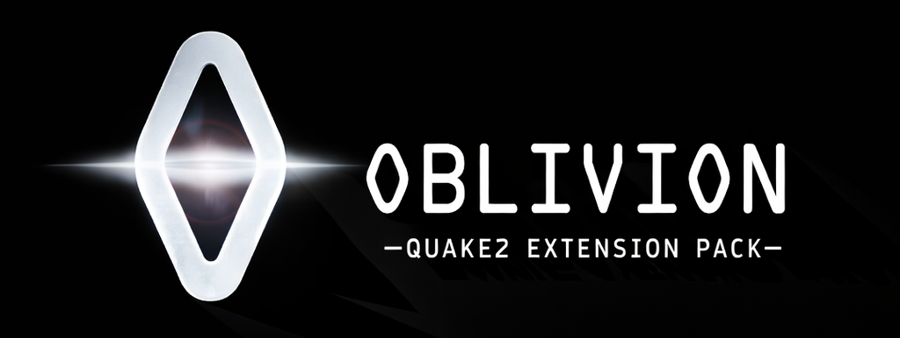

<div align="center">
  

  # Oblivion Reverse
  **Restoring the Legendary Quake II Mod**

  [](LICENSE)
  []()
  []()

  <p align="center">
    A reverse engineering project to preserve and enhance the seminal <b>Oblivion extension pack</b> for Quake II.
    <br />
    <a href="docs/"><strong>Explore the docs »</strong></a>
    <br />
    <br />
    <a href="#getting-started">Getting Started</a>
    ·
    <a href="#features">Features</a>
    ·
    <a href="#contributing">Contributing</a>
  </p>
</div>

---

## 📖 Overview

**Oblivion Reverse** is dedicated to the preservation and study of the classic *Oblivion* mod, originally released by Lethargy Software. By analyzing legacy binaries and reconstructing the source code, this project aims to:

*   **Preserve** a piece of Quake II history in a compile-ready state.
*   **Document** the unique AI, weapon systems, and mission scripting that defined the mod.
*   **Enhance** the experience for modern source ports while respecting the original vision.

## ✨ Features

*   **Reconstructed AI**: Detailed recreations of the Cyborg, Spider, and other custom monsters.
*   **Mission System**: Reverse-engineered logic for the complex objective-based gameplay.
*   **Modern Build System**: CMake-based build configuration for easy cross-platform compilation.
*   **Documentation**: Extensive notes on HLIL analysis and game mechanics.

## 🚀 Getting Started

### Prerequisites

*   **Compiler**: C11-compatible (GCC, Clang, or MSVC).
*   **Build Tool**: CMake 3.16+.
*   **Assets**: Original Quake II game data (pak0.pak).
*   **Tools**: Python 3.9+ (for dev scripts).
*   **Git LFS**: Required for asset management.

### Installation

1.  **Clone the Repository**
    ```bash
    git clone https://github.com/<your-account>/oblivion-reverse.git
    cd oblivion-reverse
    git submodule update --init --recursive
    ```

2.  **Build the Mod**
    ```bash
    cmake -S . -B build -A Win32  # Windows (32-bit recommended for original Q2 compatibility)
    cmake --build build --config Release
    ```

3.  **Run**
    Copy `gamex86.dll` (or `game.so`) to your Quake II `oblivion` directory and launch:
    ```bash
    quake2 +set game oblivion
    ```

## 🏗️ Repository Structure

| Directory | Description |
| :--- | :--- |
| `src/` | Core C source code for the game DLL. |
| `pack/` | Game assets (models, sounds, maps). Managed via LFS. |
| `docs/` | Research notes, analysis, and developer guides. |
| `references/` | Decompiled scripts, original readmes, and helper tools. |

## 🤝 Contributing

We welcome contributions from the community!

1.  Fork the Project
2.  Create your Feature Branch (`git checkout -b feature/AmazingFeature`)
3.  Commit your Changes (`git commit -m 'Add some AmazingFeature'`)
4.  Push to the Branch (`git push origin feature/AmazingFeature`)
5.  Open a Pull Request

## 📜 Credits

*   **Original Mod**: Copyright © 1998-1999 Lethargy Software, Inc. [Official Page](https://www.celephais.net/oblivion/main.html).
*   **Special Thanks**:
    *   **Konig Varorson** ([GitHub](https://github.com/Konig-Varorson)) - For invaluable monster recreations and feedback.
    *   **Nicco** - For extensive testing.

## 📄 License

Distributed under the GNU General Public License v2. See `LICENSE` for more information.

---
<div align="center">
  <sub>Built with ❤️ by the Quake II Community</sub>
</div>
