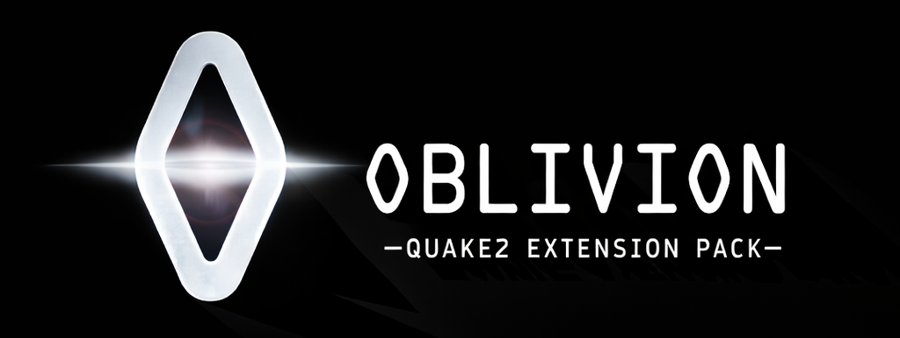

  

  <h1>Oblivion Reconstructed</h1>
  
<strong>An accurate reconstruction of the original Oblivion Quake II mod source code, bugs and all.</strong>

  

    
    
    
  

  

    <a href="#project-goal">Project Goal</a>
    &nbsp;·&nbsp;
    <a href="#installation">Installation</a>
    &nbsp;·&nbsp;
    <a href="#building-from-source">Build From Source</a>
    &nbsp;·&nbsp;
    <a href="#repository-layout">Repository Layout</a>
  

<h2 id="project-goal">Project Goal</h2>

  <strong>Oblivion Reverse</strong> exists to recover the original Oblivion mod source code as faithfully as possible from the retail binaries,
  reverse-engineering artifacts, and reference data. The target is not a cleaned-up reinterpretation of Oblivion. The target is the original gameplay,
  original behaviors, and original quirks, reconstructed into a working source tree.

  That means this repository prioritizes retail parity over modernization. When the retail mod had rough edges, timing oddities, or gameplay bugs,
  the reconstruction aims to preserve them unless there is direct evidence that the current code diverged from retail unintentionally.

  At this point the project is in a well-developed state: the reconstruction work appears substantially in place from current reverse-engineering coverage
  and limited gameplay testing, while broader playthrough validation and edge-case confirmation remain ongoing.

<h2>What This Repository Contains</h2>

<ul>
  <li>The reconstructed Quake II game module source under <code>src/game/</code> and shared support code under <code>src/common/</code>.</li>
  <li>Reverse-engineering notes, symbol maps, and parity evidence under <code>docs/</code> and <code>docs-dev/</code>.</li>
  <li>Regression tests that lock recovered retail behavior under <code>tests/</code>.</li>
  <li>Packaging assets and runtime configuration, including <code>pack/oblivion.cfg</code>.</li>
</ul>

<h2>Platform Support</h2>

  The original retail release of <strong>Oblivion</strong> shipped for <strong>Windows only</strong>. This reconstruction project extends that recovered codebase to
  documented build and runtime support on <strong>Windows</strong>, <strong>Linux</strong>, and <strong>macOS</strong>.

  The release automation packages platform-specific binaries for all three targets so an existing Oblivion install can be updated for cross-platform use.

<table>
  <thead>
    <tr>
      <th align="left">Platform</th>
      <th align="left">Produced Module</th>
      <th align="left">Notes</th>
    </tr>
  </thead>
  <tbody>
    <tr>
      <td>Windows</td>
      <td><code>gamex86.dll</code></td>
      <td>Win32 is the intended target for original Quake II compatibility.</td>
    </tr>
    <tr>
      <td>Linux</td>
      <td><code>game.so</code></td>
      <td>Built as a shared module through CMake.</td>
    </tr>
    <tr>
      <td>macOS</td>
      <td><code>game.dylib</code></td>
      <td>Built as a shared module through CMake.</td>
    </tr>
  </tbody>
</table>

<h2 id="installation">Installation</h2>

<h3>Install From A Release Archive</h3>

<ol>
  <li>Install the original Oblivion mod first from <a href="https://www.celephais.net/oblivion/main.html">the original Oblivion release page</a>.</li>
  <li>Locate the Quake II installation that already contains the installed <code>oblivion/</code> game directory.</li>
  <li>Download the matching archive for your platform from this repository's releases.</li>
  <li>Extract the release archive directly into that Quake II installation so its bundled <code>oblivion/</code> folder merges with the existing one.</li>
  <li>Allow the extraction to replace the existing game binary and <code>oblivion.cfg</code>.</li>
  <li>Launch Quake II with <code>+set game oblivion</code> or point your source port at the installed Oblivion game directory.</li>
 </ol>

Every release archive now includes:

<ul>
  <li>the platform game module binary</li>
  <li><code>oblivion.cfg</code></li>
  <li>a standalone <code>README.html</code> release document</li>
</ul>

  These release files are not a standalone Oblivion install. They are drop-in replacements for the binary and configuration inside an existing retail Oblivion setup.

  In other words: retail Oblivion remains the required Windows-origin mod install, while this project supplies replacement binaries that let that codebase run across platforms.

<h3>Expected Layout After Extraction</h3>

<pre><code>oblivion/
  gamex86.dll   or game.so or game.dylib
  oblivion.cfg
  README.html
</code></pre>

<h2 id="building-from-source">Build From Source</h2>

Detailed build notes are maintained in <a href="docs/building.md">docs/building.md</a>. The short version is below.

<h3>Prerequisites</h3>

<ul>
  <li>A C11-capable compiler.</li>
  <li>CMake 3.16 or newer.</li>
  <li>A Quake II installation to run the produced module.</li>
  <li>Python if you want to run the regression suite.</li>
</ul>

<h3>Linux / macOS</h3>

<pre><code>cmake -S . -B build -DCMAKE_BUILD_TYPE=Release
cmake --build build
</code></pre>

The resulting module will be placed in <code>build/</code> as <code>game.so</code> on Linux or <code>game.dylib</code> on macOS.

<h3>Windows</h3>

<pre><code>cmake -S . -B build -A Win32 -DCMAKE_BUILD_TYPE=Release
cmake --build build --config Release
</code></pre>

  The resulting module will be emitted as <code>build/Release/gamex86.dll</code> for Visual Studio generators,
  or <code>build/gamex86.dll</code> for single-config generators.

<h3>Install A Local Build</h3>

<ol>
  <li>Build the module for your platform.</li>
  <li>Install the original Oblivion mod from <a href="https://www.celephais.net/oblivion/main.html">the original release page</a> if it is not already present.</li>
  <li>Copy the produced binary into that existing Quake II <code>oblivion/</code> game directory.</li>
  <li>Copy <code>pack/oblivion.cfg</code> to replace the installed configuration if you want the repository's current default bindings and settings.</li>
  <li>Launch Quake II with <code>+set game oblivion</code>.</li>
</ol>

<h2>Nightly Releases</h2>

  Nightly release automation builds Linux, macOS, and Windows artifacts from the top-level semantic version stored in <code>VERSION</code>.
  Nightly tags use the format <code>v&lt;base-version&gt;-nightly.YYYYMMDD</code>.

  The current base version is <code>1.0.0</code>, reflecting a mature reconstruction state rather than an early bootstrap snapshot.

<h2 id="repository-layout">Repository Layout</h2>

<table>
  <thead>
    <tr>
      <th align="left">Path</th>
      <th align="left">Purpose</th>
    </tr>
  </thead>
  <tbody>
    <tr>
      <td><code>src/</code></td>
      <td>Reconstructed game-module source code.</td>
    </tr>
    <tr>
      <td><code>pack/</code></td>
      <td>Runtime configuration and packaged game data.</td>
    </tr>
    <tr>
      <td><code>docs/</code></td>
      <td>User-facing notes and technical documentation.</td>
    </tr>
    <tr>
      <td><code>docs-dev/</code></td>
      <td>Reverse-engineering and parity mapping notes.</td>
    </tr>
    <tr>
      <td><code>references/</code></td>
      <td>Reference-only reverse-engineering exports and preserved source material.</td>
    </tr>
    <tr>
      <td><code>tests/</code></td>
      <td>Regression coverage for recovered retail behavior.</td>
    </tr>
  </tbody>
</table>

<h2>Credits And Attribution</h2>

  The key creative credit remains with the original <strong>Oblivion</strong> release by <strong>Lethargy Software</strong>.
  This repository is a reconstruction effort focused on preservation, analysis, and faithful source recovery.

  As tribute to the original release, the core Oblivion team credits are preserved here in a cleaner modern form.

<table>
  <thead>
    <tr>
      <th align="left">Discipline</th>
      <th align="left">Original Oblivion Team</th>
    </tr>
  </thead>
  <tbody>
    <tr>
      <td>Programming</td>
      <td>Mike "Gripp" Ruete; Tim "Argh" Wright</td>
    </tr>
    <tr>
      <td>Level Design</td>
      <td>Dan "Infliction" Haigh; Alex "MonkeyDonut" Gingell; Dan "Trebz" Nolan; Sean "Spider" Soucy</td>
    </tr>
    <tr>
      <td>Artwork</td>
      <td>John "MetalSlime" Fitzgibbons; Tyler "Witz" Wilson; Eli "Dunan" Karney; SmokyG</td>
    </tr>
    <tr>
      <td>Models</td>
      <td>Andrew "Betlog" Eglington; Matt Hasselman; John "Jonny" Gorden; Rorshach</td>
    </tr>
    <tr>
      <td>Music</td>
      <td>Carl "Dill" Bown</td>
    </tr>
    <tr>
      <td>Website / Manual</td>
      <td>Ryan "BabelFish" Freebern</td>
    </tr>
  </tbody>
</table>

  Additional contributor credit remains warranted where reconstruction-era code, research, or testing remnants may still be present in the repository history and current tree.

<ul>
  <li><strong>Konig Varorson</strong> for earlier monster recreation code that may have inadvertently helped guide parts of the reverse-engineering process.</li>
  <li><strong>Nicco</strong> for testing support and feedback that remains directly relevant to the project.</li>
</ul>

<h2>License</h2>

This repository is distributed under the GNU General Public License v2. See <a href="LICENSE">LICENSE</a> for details.

